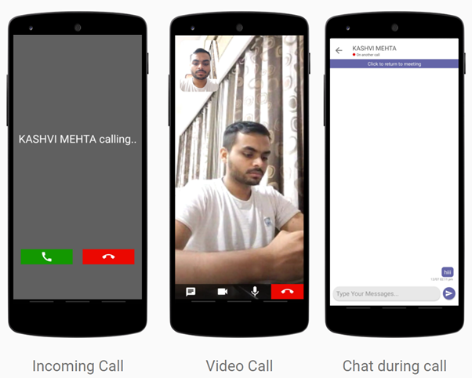

# Teams-Clone

A Microsoft Teams Clone developed for Microsoft Engage 2021.

## How to use

### On android device

Download APK and install it in your android device: [Click here to download APK]()

### To run on local system

- Clone this repository 
- Start android studio
- Open Teams Clone

## Agile Methodology

- I have used agile scrum methodology while developing the prototype. 
- I did my work by creating sprints of my own to implement important features in my project.
- I continuously integrated new features and resolved bugs of the previous integrated features.

## Features

- Sign in with google
- Video Calling between two users
- Toggle Video during call
- Toggle Audio during call
- Picture in Picture mode available during video call
- Name of person calling is displayed
- User can accept / reject incoming call
- Realtime status updated- Online, Offline, On another call
- Realtime Chat between two users
- Chat before meeting
- Chat during meeting 
- Chat after meeting
- Messages timestamp displayed
- User can add Notes/Task
- Set priority of tasks- low, moderate and top
- Edit a task
- Delete a task
- User Profile view (Name, Profile Picture and Email)
- Motivation (Display a motivational quote to user)
- Share Motivational quote with others
- Activities (Display a random activity to user)
- Add activity to task
- Share activity with others
- Github repository link
- Share the app with others
- Logout

## Demo video

Click to watch : [Demo Video]()

## Documents

#### Presentation: [Click here]()

#### Timeline for my project: [Click here](https://drive.google.com/file/d/1KI5pz7G9JuBxw7ACOQXMLWI0IpQFcpF7/view)

## Class Interaction Diagram

## Screenshots

## Libraries and API's used

- [Peer JS](https://peerjs.com)
- [Quotable API](https://github.com/lukePeavey/quotable)
- [Bored API](https://www.boredapi.com/)

## Future Scope

- Notification for call and chat can be implemented.
- Group Video calling and chatting can be included.
- Screen Sharing can be integrated.
